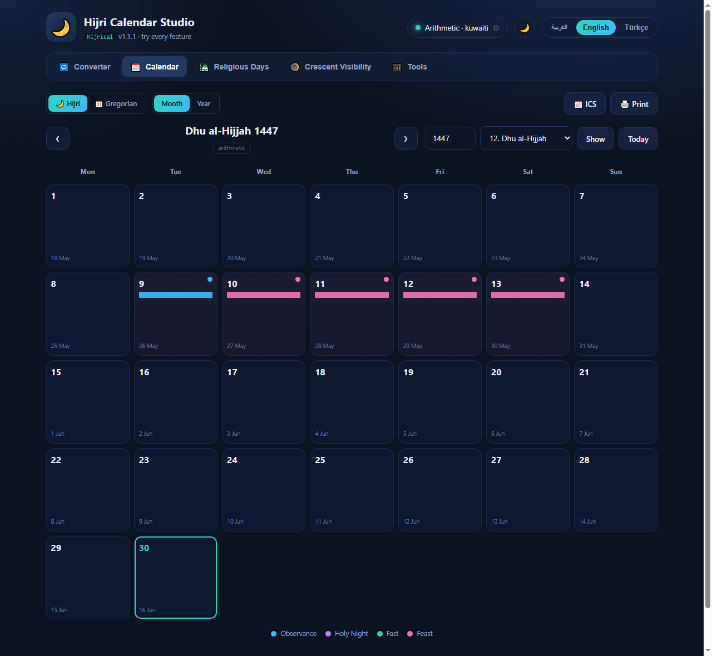

# hijrical Studio 🌙

**An interactive web playground for the [`hijrical`](https://pypi.org/project/hijrical/) Hijri ⇄ Gregorian date library** — exercises every public feature in a polished UI, and runs either locally or *entirely in your browser* (no backend) thanks to Pyodide.

[](https://kbycode.github.io/hijrical-studio/)
[](https://pypi.org/project/hijrical/)
[](LICENSE)


> The UI ships in **English, Turkish and Arabic** (with automatic RTL) and a dark/light theme.

<p align="center">
  <a href="https://kbycode.github.io/hijrical-studio/">
    
  </a>
</p>

## ▶️ Try it now

**[kbycode.github.io/hijrical-studio](https://kbycode.github.io/hijrical-studio/)** — the live demo loads Pyodide and `micropip install`s the real `hijrical` package from PyPI, then runs everything client-side. No server, nothing to install.

## Features

- **Converter** — Gregorian ⇄ Hijri both ways, with weekday, month name, JDN, month/year length, leap year, day-of-year and religious-day info. Optional **time + location** honours the sunset day-boundary (`HijriDate.at`): an instant after maghrib rolls to the next Hijri day.
- **Calendar** — **Hijri / Gregorian dual layout** and **month / year** views; every cell shows both date systems. Religious days are colour-coded; click a day for a short description and a "days left / ago" countdown. The grid reflects the selected **engine** (e.g. with the *ircica* astronomical engine 2026‑06‑16 = 1 Muharram, vs 30 Dhu al-Hijjah on the tabular engine). Export religious days as **`.ics`** or **print / save to PDF**.
- **Religious Days** — upcoming-days countdown plus the full list for a chosen Hijri year, with `.ics` export.
- **Crescent Visibility** — for a place, criterion and evening: a drawn **crescent moon** (from the illuminated fraction) plus illumination %, elongation, altitude, ARCV, moon age, lag, width and sunrise/sunset. Includes a **multi-city comparison** ("X / 12 cities can see it") and a **🗺️ map location picker**. `conjunction` and `umm_al_qura` are flagged as *calendar rules* (not naked-eye visibility).
- **Tools** — a **Hijri age calculator** (Hijri age + countdown to your next Hijri birthday) and **date arithmetic** (add/subtract days, difference between two dates).

The calculation engine is switchable from the header: **Arithmetic** (tabular, reversible, unbounded) with selectable variants, or **Astronomical** (real crescent visibility) with observer, criterion (IRCICA, MABIMS, Umm al-Qura, …) and local/global scope.

## Run it

### 1. Live demo (nothing to install)
Just open **[the demo](https://kbycode.github.io/hijrical-studio/)**.

### 2. Install from PyPI
```bash
pip install hijrical-studio
hijrical-studio            # opens http://127.0.0.1:8770 in your browser
```

### 3. From source
```bash
git clone https://github.com/kbycode/hijrical-studio
cd hijrical-studio
pip install hijrical       # the only dependency
python run.py              # or: python -m hijrical_studio
```

Useful flags: `--port 9000`, `--no-browser`.

## How it works

The API layer ([`hijrical_studio/web/studio_api.py`](hijrical_studio/web/studio_api.py)) is **transport-neutral**: a set of small JSON-returning functions behind one `handle(name, params)` dispatcher. The single front-end (`web/`) talks to it through one abstraction that runs in **two modes**:

| Mode | When | How the API is reached |
|------|------|------------------------|
| **Server** | `hijrical-studio` / `python -m hijrical_studio` | tiny stdlib HTTP server forwards `POST /api/<name>` to `handle` |
| **Pyodide** | GitHub Pages / any static host | the page loads Pyodide, `micropip` installs `hijrical`, and calls `handle` directly in the browser |

`boot.js` auto-detects the mode (it pings `/api/ping`; if there's no server it falls back to Pyodide). This is only possible because **`hijrical` is pure Python with zero dependencies** — it compiles to WebAssembly cleanly, astronomical crescent maths included.

## Built on hijrical

This is a companion/showcase project for **[`hijrical`](https://pypi.org/project/hijrical/)** — accurate, location-aware Hijri ⇄ Gregorian conversion with crescent-visibility support. All dates, calendars and visibility results come straight from that library; this repo only adds the UI and short localized descriptions for religious days.

## License

MIT © kbycode. See [LICENSE](LICENSE).
